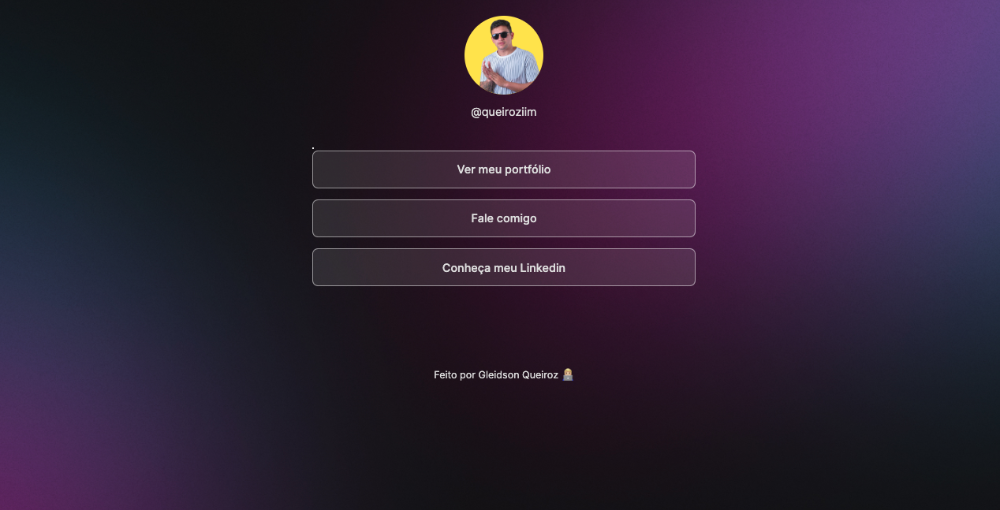

# 💻 #DevLinks

[🚀 Acesse aqui](https://queiiroz.github.io/b2someluz/)

## 💻 Projeto

O DevLinks é um agregador de links para usar como cartão de visitas online.

## 🎨 Layout do projeto

Este é o <a href="https://www.figma.com/file/FdASZ2r6bPFICpPzYatPZJ/DevLinks-%E2%80%A2-Projeto-Discover-(Copy)?type=design&node-id=58-415&t=QLDD0Hpen3S4P7iQ-0">layout do projeto</a> no Figma.

## 🛠 Tecnologias

- HTML
- CSS
- JavaScript
- Git
- GitHub
- Figma

<table>
  <tr>
    <td>
     
    </td>
    <td>
      Feito por Gleidson Queiroz.</a> 🙋🏼‍♂️
    </td>
  </tr>
</table>
